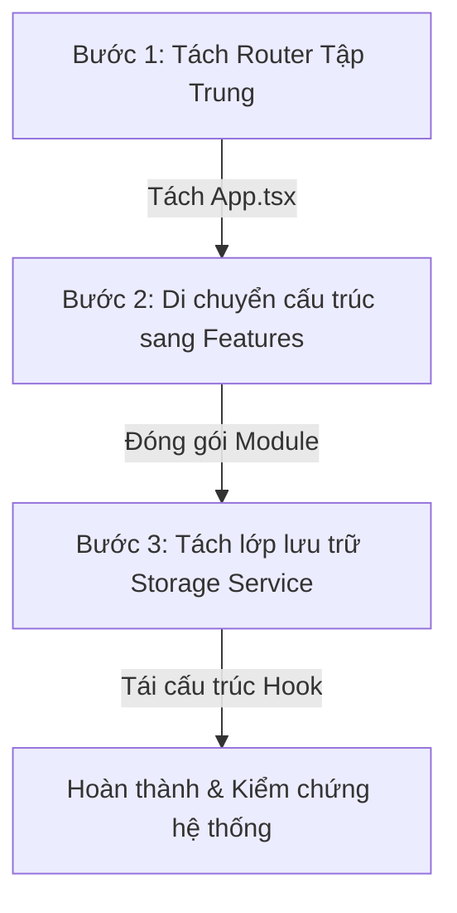

# 🛡️ AI Learning Notebook: Kiến trúc Hệ thống & Lộ trình Tái cấu trúc Chuyên sâu

> **Tác giả:** Antigravity (Principal AI Engineer @ Google DeepMind)  
> **Trạng thái:** Kế hoạch Thiết kế & Tái cấu trúc (Design & Refactoring Roadmap)  
> **Mục tiêu:** Feature-Driven Architecture, Centralized Routing, Separation of Concerns (SoC), Service Layer Pattern.

---

## 📌 1. Bối cảnh dự án (Project Context)
Dự án **AI Learning Notebook** là một ứng dụng sổ tay học thuật hỗ trợ người học hệ thống hóa lộ trình nghiên cứu AI, lưu trữ prompt mẫu và ghi chép nhật ký học tập. 
Ứng dụng sử dụng stack công nghệ hiện đại bao gồm: **React 19 + TypeScript + MUI 9 (Material UI) + Tailwind CSS v4 + Vite**.

Để chuẩn bị cho việc mở rộng thêm các tính năng thông minh (như tích hợp AI Assistant, phân tích biểu đồ tiến trình nâng cao), hệ thống cần một nền móng kiến trúc bền vững. Bài viết này phân tích sâu sắc hiện trạng của dự án, đối chiếu với các bài học thực tế từ dự án lớn như **InsureGO**, từ đó đề xuất mô hình cấu trúc thư mục và quy tắc phát triển đạt chuẩn công nghiệp.

---

## ⚠️ 2. Đánh giá Kiến trúc & Nợ kỹ thuật (Technical Debt Audit)

Qua đợt rà soát toàn diện mã nguồn hiện tại, chúng tôi phát hiện 3 vấn đề kiến trúc cốt lõi cần giải quyết ngay để tránh tích tụ nợ kỹ thuật:

### 2.1. Monolithic Routing (Định tuyến nguyên khối trong App.tsx)
*   **Hiện trạng:** Toàn bộ cấu hình định tuyến (`BrowserRouter`, `Routes`, `Route`) đang được khai báo trực tiếp dưới dạng JSX lồng nhau bên trong [App.tsx](file:///Users/phamminhtri/Desktop/train/ai-vibe-project/AI_LEARNING_WITH_AGENT_SKILLS/src/App.tsx).
*   **Hậu quả:** File `App.tsx` bị quá tải trách nhiệm (vi phạm nguyên tắc Single Responsibility Principle). Khi số lượng trang tăng lên, việc cấu hình Layout lồng nhau, Route Guards (chặn truy cập, phân quyền), hoặc lazy loading sẽ trở nên cực kỳ hỗn loạn và khó bảo trì.
*   **Giải pháp:** Tách biệt hoàn toàn tầng định tuyến ra thư mục riêng biệt `src/router/` bằng cách sử dụng **Centralized Route Configuration** (Cấu hình Route tập trung dưới dạng mảng đối tượng).

### 2.2. Flat Directory Structure (Cấu trúc phẳng theo lớp kỹ thuật)
*   **Hiện trạng:** Các thư mục `src/components/`, `src/pages/` đang chứa chung tất cả các components và trang của toàn bộ các tính năng khác nhau (từ Dashboard, Roadmap đến Learning Log).
*   **Hậu quả:** Gây khó khăn lớn trong việc định vị code khi dự án phát triển rộng. Ví dụ, để chỉnh sửa tính năng *Learning Log*, lập trình viên phải mở `src/pages/LearningLog.tsx`, tìm kiếm component phụ trong `src/components/`, và tra cứu hook liên quan trong `src/hooks/`. Sự phân tán này làm tăng Cognitive Load (tải nhận thức) và dễ gây ảnh hưởng chéo ngoài ý muốn (regression bugs).
*   **Giải pháp:** Chuyển dịch sang mô hình **Feature-Driven Architecture (Architecture theo tính năng)**. Đóng gói toàn bộ giao diện, logic (hooks), service và type của một nghiệp vụ cụ thể vào một thư mục con tương ứng trong `src/features/`.

### 2.3. Direct Storage Coupling (Ràng buộc chặt với LocalStorage)
*   **Hiện trạng:** Hook `useLessonProgress.ts` và logic trong `LearningLog.tsx` đang trực tiếp thao tác đọc/ghi dữ liệu vào `localStorage` thông qua các API trình duyệt.
*   **Hậu quả:** Vi phạm nguyên tắc Separation of Concerns (Phân tách mối quan tâm). Logic giao diện bị phụ thuộc hoàn toàn vào cơ chế lưu trữ vật lý. Nếu trong tương lai ứng dụng cần đồng bộ cloud (Firebase, Supabase, hoặc REST API), chúng ta sẽ phải đập đi xây lại toàn bộ các components và hooks liên quan.
*   **Giải pháp:** Áp dụng **Service Pattern**. Xây dựng lớp dịch vụ lưu trữ dữ liệu trung gian (`progressStorage.ts`, `logStorage.ts`) đóng vai trò làm cổng kết nối (Adapter). Hooks và components chỉ giao tiếp qua Service Interface, độc lập với việc dữ liệu được lưu ở RAM, LocalStorage hay Cloud Database.

---

## 💡 3. Bài học thực tế rút ra từ dự án InsureGO

Khi phân tích cấu trúc của dự án **InsureGO**, chúng ta thu được những bài học đắt giá để tối ưu hóa ứng dụng AI Learning Notebook:

| Vấn đề của InsureGO | Hệ quả thực tế | Giải pháp áp dụng cho AI Learning Notebook |
| :--- | :--- | :--- |
| **Mega-Context & State Sprawl** | Sử dụng React Context làm kho chứa dữ liệu API quá mức, gây re-render toàn bộ ứng dụng và gọi API trùng lặp (Over-fetching). | **Local-First & Feature-First**: Chỉ lưu trữ UI State ở mức cục bộ nhất có thể. Dữ liệu tiến trình học được đóng gói trong Feature Service chuyên biệt, không lạm dụng Global Context. |
| **Monolithic Type System** | Tệp tin `typesGlobal.tsx` phình to quá mức (>800 dòng), chứa cả type dùng chung lẫn type cục bộ của từng trang riêng lẻ. | **Colocation of Types**: Định nghĩa type ngay tại nơi nó được sử dụng (trong từng Feature). Chỉ đưa các type thực sự mang tính hệ thống (như `Lesson`, `RoadmapTopic`) vào thư mục `src/types/` chung. |
| **Manual Data Orchestration** | Quản lý vòng đời dữ liệu API (Loading, Error, Caching) hoàn toàn thủ công qua `useEffect`. | **Service Adapters**: Đóng gói toàn bộ logic truy xuất dữ liệu vào Service Layer sạch sẽ, chuẩn bị sẵn sàng cho việc tích hợp React Query (TanStack Query) sau này. |

---

## 🛠️ 4. Mô hình cấu trúc thư mục mới đề xuất (Feature-Driven Architecture)

Để đảm bảo tính chuyên nghiệp, dễ bảo trì và dễ mở rộng, toàn bộ dự án sẽ được tổ chức lại theo sơ đồ thư mục dưới đây:

```text
src/
├── assets/                           # Tài nguyên tĩnh dùng chung (logo, images, fonts)
├── core/                             # Các thành phần cốt lõi của hệ thống (Shared Kernel)
│   ├── components/                   # UI Components dùng chung (ProgressBar, PromptBlock)
│   ├── layouts/                      # Layout khung của ứng dụng
│   │   └── AppLayout.tsx             # Layout chính (Sidebar + Content Area + Mobile Header)
│   └── theme/                        # Cấu hình MUI Design Tokens & Color Mode Provider
├── router/                           # Định tuyến tập trung (Centralized Routing)
│   ├── paths.ts                      # Quản lý hằng số URL Paths (tránh hardcode string)
│   ├── routes.tsx                    # Định nghĩa mảng cấu hình RouteObject
│   └── index.tsx                     # Khởi tạo RouterProvider và xuất bản AppRouter
├── data/                             # Dữ liệu tĩnh gốc (Seed Data)
│   ├── lessons.ts                    # Dữ liệu bài học AI cố định
│   └── roadmap.ts                    # Cấu trúc lộ trình học thuật
├── features/                         # Các module tính năng độc lập (Feature Modules)
│   ├── dashboard/                    # Module Bảng điều khiển tiến trình học
│   │   ├── components/               # Components cục bộ của Dashboard
│   │   └── pages/
│   │       └── DashboardPage.tsx     # Trang Dashboard
│   ├── roadmap/                      # Module Lộ trình & Bài học chi tiết
│   │   ├── components/               # RoadmapCard, LessonCard, StatusBadge
│   │   ├── hooks/                    # useLessonProgress.ts (Quản lý UI State tiến trình)
│   │   ├── services/                 # Tầng thao tác lưu trữ tiến trình học
│   │   │   └── progressStorage.ts    # Service đọc/ghi dữ liệu bài học
│   │   └── pages/
│   │       ├── RoadmapPage.tsx       # Trang tổng quan lộ trình
│   │       └── LessonDetailPage.tsx  # Trang chi tiết bài học & code editor
│   ├── prompt-playbook/              # Module Thư viện Prompt mẫu
│   │   ├── components/               # PromptBlock (nếu chỉ dùng ở đây)
│   │   └── pages/
│   │       └── PromptPlaybookPage.tsx
│   └── learning-log/                 # Module Nhật ký học tập
│       ├── components/               # CalendarView, LogForm, v.v.
│       ├── services/                 # Tầng lưu trữ nhật ký học tập
│       │   └── logStorage.ts         # Service đọc/ghi nhật ký học
│       └── pages/
│           └── LearningLogPage.tsx   # Trang viết nhật ký
├── types/                            # Khai báo TypeScript types dùng chung toàn hệ thống
│   ├── index.ts                      # Tập trung xuất bản các types
│   ├── lesson.ts                     # Định nghĩa cấu trúc Lesson, Topic
│   └── progress.ts                   # Định nghĩa cấu trúc lưu trữ tiến trình
├── App.tsx                           # Cực kỳ tinh gọn, chỉ chứa RouterProvider và Global Providers
├── main.tsx                          # Entry point
└── index.css                         # Custom styling chính
```

---

## 🚀 5. Lộ trình thực hiện tái cấu trúc (Refactoring Roadmap)

Quá trình chuyển đổi cấu trúc sẽ được thực hiện tuần tự qua 3 bước nhỏ để đảm bảo ứng dụng luôn build thành công (`zero-downtime`) và không gây ảnh hưởng đến dữ liệu hiện có trong `localStorage` của người học:



### 📑 Bước 1: Thiết lập Router Tập Trung (`src/router/`)
*   **Hành động:** 
    1. Tạo thư mục `src/router/` và các file `paths.ts`, `routes.tsx`, `index.tsx`.
    2. Định nghĩa các hằng số đường dẫn trong `paths.ts` (ví dụ: `PATH_DASHBOARD = '/'`, `PATH_ROADMAP = '/roadmap'`).
    3. Cấu hình mảng routes lồng nhau trong `routes.tsx` sử dụng layout chung `AppLayout`.
    4. Tinh gọn [App.tsx](file:///Users/phamminhtri/Desktop/train/ai-vibe-project/AI_LEARNING_WITH_AGENT_SKILLS/src/App.tsx), loại bỏ logic routing JSX, thay bằng `<RouterProvider router={router} />`.
*   **Mục tiêu kiểm tra:** Chạy `bun run build` đảm bảo ứng dụng định tuyến mượt mà và không bị trắng trang khi deploy.

### 📦 Bước 2: Module hóa mã nguồn sang `src/features/`
*   **Hành động:**
    1. Tạo các thư mục con trong `src/features/`.
    2. Di chuyển các trang từ `src/pages/` sang đúng trang của từng feature (ví dụ: `Dashboard.tsx` -> `src/features/dashboard/pages/DashboardPage.tsx`).
    3. Di chuyển các components đặc thù từ `src/components/` vào thư mục `components/` của từng feature tương ứng (ví dụ: `RoadmapCard.tsx` chuyển vào `src/features/roadmap/components/`).
    4. Cập nhật lại toàn bộ đường dẫn `import` trong dự án.
*   **Mục tiêu kiểm tra:** Không còn file rác nằm ngoài luồng nghiệp vụ. Ứng dụng chạy dev bình thường.

### 💾 Bước 3: Tách biệt Storage Service & Xây dựng Lớp Lưu trữ Độc lập
*   **Hành động:**
    1. Tạo `progressStorage.ts` trong `src/features/roadmap/services/`.
    2. Di chuyển logic đọc/ghi `localStorage` từ `useLessonProgress.ts` vào Service mới này.
    3. Tạo `logStorage.ts` trong `src/features/learning-log/services/` để quản lý việc lưu trữ nhật ký học tập độc lập.
    4. Cập nhật các hooks và pages để chỉ gọi hàm thông qua API của Service.
*   **Mục tiêu kiểm tra:** Kiểm tra dữ liệu của người dùng cũ được bảo toàn 100%. Tương thích ngược hoàn hảo.

---

## 🤖 6. Quy tắc Phát triển dành cho lập trình viên & AI Agents

Khi làm việc trong dự án này, bất kỳ nhà phát triển hoặc AI Agent nào cũng phải tuân thủ nghiêm ngặt các nguyên tắc thiết kế mã nguồn sau:

1.  **Nguyên tắc Feature-First (Tính năng trên hết):** 
    *   *Quy tắc:* Tuyệt đối không tạo file tùy tiện trong `src/components/` hay `src/pages/`. Trước khi viết một component hay page mới, hãy luôn tự hỏi: *"Thành phần này thuộc nghiệp vụ (Feature) nào?"* để đưa vào đúng thư mục.
2.  **Nguyên tắc Không Hardcode đường dẫn URL:**
    *   *Quy tắc:* Khi cần điều hướng trang (sử dụng hook `useNavigate` hoặc component `Link`), bắt buộc phải import hằng số đường dẫn từ `src/router/paths.ts`. Không viết chuỗi thô (ví dụ: dùng `PATH_ROADMAP` thay vì viết trực tiếp `'/roadmap'`).
3.  **Nguyên tắc Đóng gói Dữ liệu (Encapsulation of State):**
    *   *Quy tắc:* Tách biệt rạch ròi giữa UI State (đang mở modal, đang load...) và Data Persistence (dữ liệu lưu trữ lâu dài). Mọi logic đọc/ghi dữ liệu lâu dài phải thông qua Service Layer, không được viết trực tiếp API trình duyệt trong UI component.
4.  **Quy chuẩn commit chuyên nghiệp:**
    *   *Quy tắc:* Tất cả các thay đổi phải được commit theo chuẩn **Semantic Commits** (ví dụ: `feat(roadmap): thêm component tiến độ bài học`, `refactor(router): tách định tuyến tập trung`). Tham chiếu quy chuẩn chi tiết tại [AGENTS.md](file:///Users/phamminhtri/Desktop/train/ai-vibe-project/AI_LEARNING_WITH_AGENT_SKILLS/.agents/skills/git-commit-excellence/AGENTS.md).
